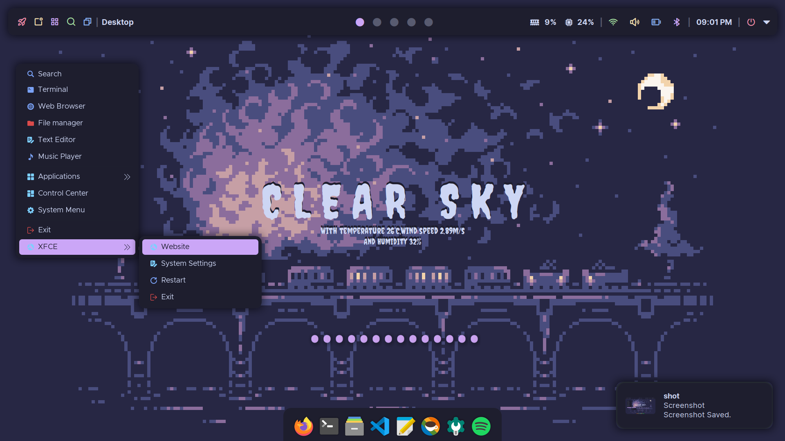
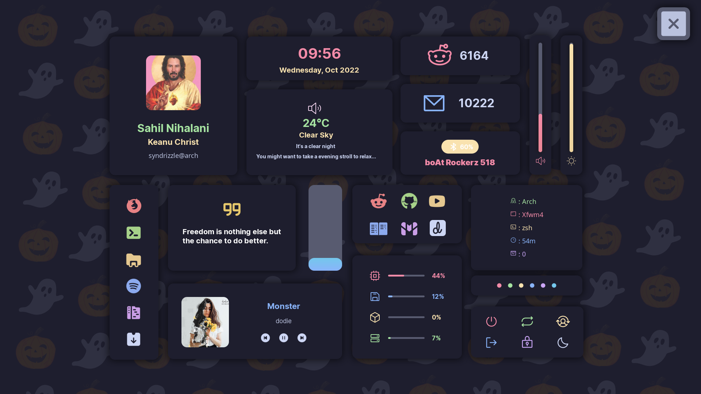
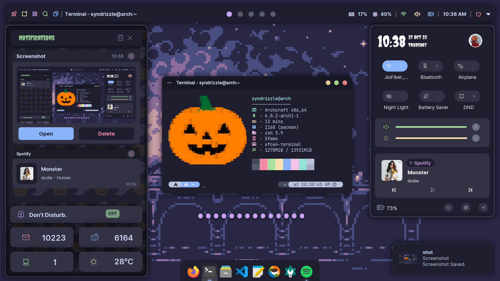
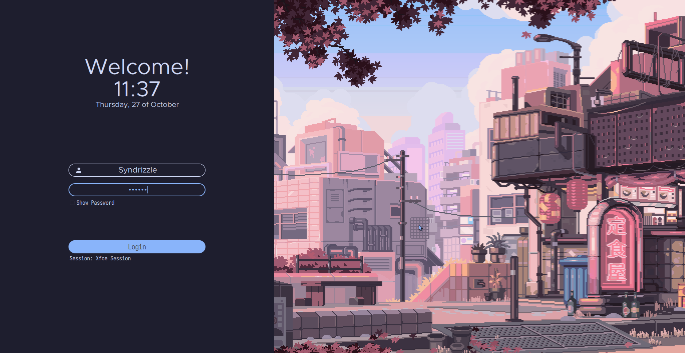

  

&nbsp;&nbsp;&nbsp;&nbsp;&nbsp;&nbsp;&nbsp;&nbsp;&nbsp;

### ⚠️ NOTE!!! ⚠️ NOTE!!! ⚠️
These dotfiles are not intended to be used as a daily driving medium, I have only uploaded them here so others can get a reference of it. Please, do not open issues about something not working when using these dots, I am sorry but I will not provide any support regarding these dots.

#### About:
* **XFCE** as the Desktop Environment.
* **Catppuccin** as the color scheme.
* **Dunst (Fork)** as the notification daemon.
* **EWW** as the widgets.
* **Polybar** as the bar.
* **Picom (Dccsillag)** as the compositor.
* **Rofi** as the application menu.
* **JGMenu** as the desktop menu.
* **SDDM** as the desktop manager.
* **Some love** as the essence!

## Screenshots:

  

  

## Credits:
Thanks to:
* [dharmx](https://github.com/dharmx)
* [janleigh](https://github.com/janleigh)
* [Axarva](https://github.com/Axarva)
* [adi1090x](https://github.com/adi1090x)
* [catppuccin](https://github.com/catppuccin)

The icons used in this dotfiles are from the [Phosphor Icons](https://phosphoricons.com/) project. 
The external icons are from Icons8,FlatIcons and IconScout, and are used under the [CC BY 4.0](https://creativecommons.org/licenses/by/4.0/) license.
